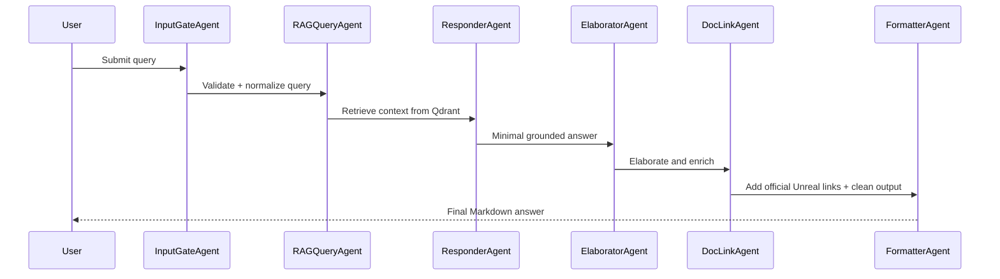
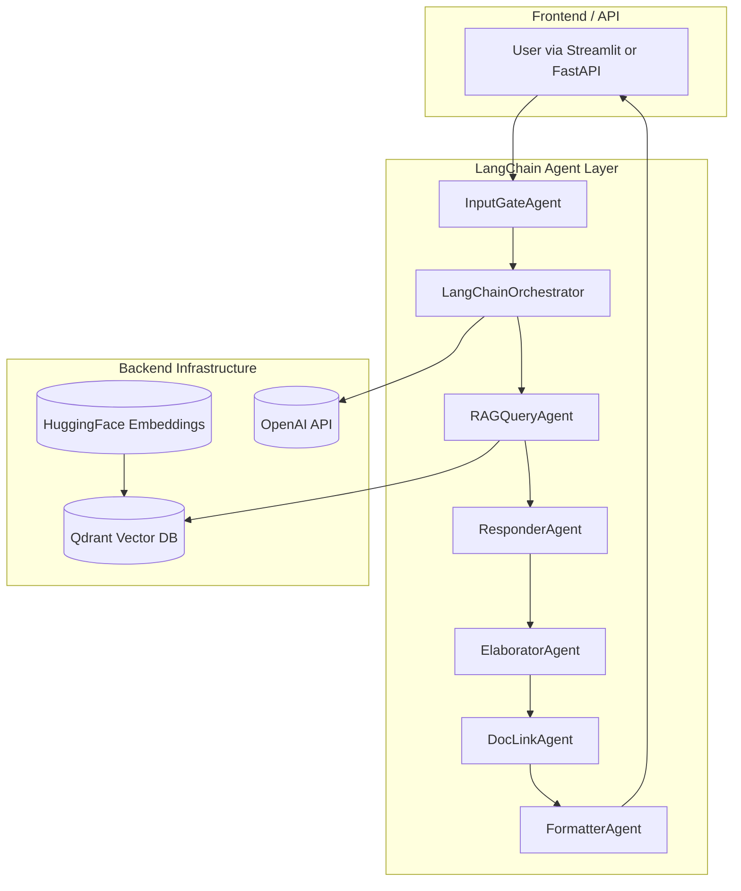

# 🧠 UE5 Dev Copilot — Multi-Agent LangChain System for Unreal Engine 5

## Overview

**UE5 Dev Copilot** is a modular, LangChain-powered multi-agent system designed to assist Unreal Engine developers by retrieving, analyzing, and summarizing plugin, module, and source documentation.  
It indexes local Unreal source trees and plugin folders into a **Qdrant vector database**, enabling rich semantic search and contextual reasoning about UE5 codebases.

The orchestrator coordinates multiple **domain-specific agents** — from retrieval and summarization to documentation linking — producing grounded Markdown answers enriched with citations, diagrams, and elaborations.

---

## 📁 Project Structure
```
agentic-copilot/
├─ docker-compose.yml
├─ app/
│ ├─ Dockerfile
│ ├─ requirements.txt
│ └─ src/
│ ├─ main.py
│ ├─ settings.py
│ ├─ vectordb.py
│ ├─ embeddings.py
│ ├─ indexer.py
│ ├─ memory_store.py
│ ├─ agents/
│ │ ├─ langchain_orchestrator.py
│ │ ├─ input_gate.py
│ │ ├─ rag_query.py
│ │ ├─ responder.py
│ │ ├─ formatter.py
│ │ ├─ inventory_agent.py
│ │ ├─ elaborator_agent.py
│ │ └─ doclink_agent.py
│ └─ utils/
│ ├─ logging_utils.py
│ └─ constants.py
└─ data/
├─ ingest/
├─ out/
└─ qdrant/
```


---

## 🧱 Tech Stack

| Layer | Technology | Purpose |
|-------|-------------|----------|
| Runtime | **Python 3.11** | Core runtime environment |
| AI Framework | **LangChain Core**, **LangChain OpenAI** | Agent orchestration & model integration |
| Vector Store | **Qdrant (1.15+)** | Persistent semantic retrieval backend |
| Embeddings | **HuggingFace - BAAI/bge-small-en** | 384-dimension document embeddings |
| LLM | **OpenAI GPT-4.1-mini / GPT-4.1-turbo** | Language reasoning and elaboration |
| API/Frontend | **FastAPI** or **Streamlit UI** | User query interface and web app |
| DevOps | **Docker Compose**, **uvicorn** | Containerized multi-service deployment |
| Testing | **pytest** | Automated test execution for agents and orchestration |

---

## 🤖 Agent Architecture

### 🔹 InputGateAgent
Validates and sanitizes user queries. Detects intents such as “list plugins,” “describe module,” or “show functions.”  
- **Input**: Raw user query  
- **Output**: Structured query dictionary  

### 🔹 RAGQueryAgent
Performs retrieval from **Qdrant** using a vectorized embedding search pipeline.  
- **Input**: Normalized query  
- **Output**: Top-K relevant context chunks with metadata  

### 🔹 ResponderAgent
Synthesizes the final Markdown answer using context from RAG retrieval.  
- Produces concise answers with citations.  
- Fallbacks gracefully if retrieval is insufficient.

### 🔹 FormatterAgent
Formats and cleans Markdown output, ensuring consistent headers, bullet structure, and references.

### 🔹 InventoryAgent
Scans the `/ingest/plugins/` tree to list discovered UE plugins or modules.  
Supports commands such as “list plugins” or “which plugins exist.”

### 🔹 ElaboratorAgent
Enriches short or minimal answers with detailed summaries derived from relevant README, `.uplugin`, or source files.  
Implements **escalation logic** — reruns the analysis with a higher-tier model (e.g., `gpt-4.1-turbo`) if the summary lacks depth or citations.

### 🔹 DocLinkAgent
Detects mentions of official Unreal documentation topics and appends verified URLs from the Unreal online docs.  
For example: `UStaticMeshComponent` → https://docs.unrealengine.com/5.3/en-US/API/Runtime/Engine/Components/UStaticMeshComponent/

### 🔹 LangChainOrchestrator
The **central conductor** of the agent system.  
It determines intent, dispatches to the correct pipeline, and merges the outputs.  
It manages:
- Inventory path (for plugin listings)  
- Default RAG path (for queries requiring retrieval + summarization)  
- Optional elaboration and doclink augmentation steps  
- Markdown export to `/app/out/`

---

## 🪄 Mermaid Diagram A — Sequential Data Flow



⚙️ Running Locally
🧰 Prerequisites

Python 3.11+

Docker & Docker Compose

OpenAI API key in .env

🐳 Start with Docker
docker-compose up --build


Then access:

API/UI: http://localhost:8080

Qdrant Dashboard: http://localhost:6333/dashboard

🧪 Testing the System

Create a tests/ folder with test_agents.py and use pytest:

pytest -v


Example stub:

def test_elaborator_generates_summary():
    from src.agents.elaborator_agent import ElaboratorAgent, ElaboratorConfig
    agent = ElaboratorAgent(retriever=None, cfg=ElaboratorConfig())
    result = agent.elaborate("Base content", item_label="plugin", items=["HelpfulFunctions"])
    assert isinstance(result, str)
    assert "HelpfulFunctions" in result

🧩 Extending the System

To add a new agent:

Create src/agents/<new_agent>.py with a class exposing a run() or invoke() method.

Register the agent in langchain_orchestrator.py.

Update _detect_intent() if new intent types are added.

Add tests under /tests.

Example:

from src.agents.new_agent import NewAgent
new_agent = NewAgent(cfg=CustomConfig())
output = new_agent.process(query, ctx)

🧠 Design Notes

All retrieval is semantic, grounded in Qdrant content.

The orchestrator dynamically chains agents based on detected intent.

The Elaborator escalates to higher models if output quality is insufficient.

DocLinkAgent improves explainability by adding verified Unreal documentation links.

Markdown output is saved automatically under /app/out/answer-<runid>.md.

🧾 Example Query Flow
User Prompt → InputGateAgent
           → RAGQueryAgent (retrieve context)
           → ResponderAgent (generate summary)
           → ElaboratorAgent (expand & escalate)
           → DocLinkAgent (add URLs)
           → FormatterAgent (final markdown)

📚 Example Command
curl -X POST "http://localhost:8080/ask" \
     -H "Content-Type: application/json" \
     -d '{"prompt": "List the functions in HelpfulFunctions plugin"}'


Maintained by:
Mike Purvis
