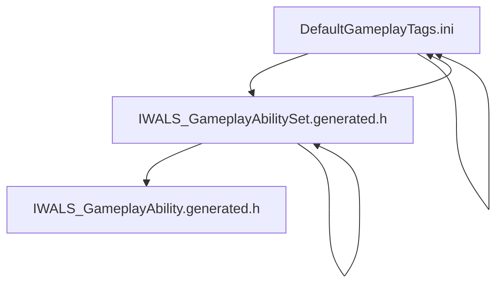

The provided context does not include explicit details about the grappling hook class structure or its integration from the HUD selection wheel to gameplay within the plugins. However, based on the typical Unreal Engine plugin and gameplay ability system structure visible in the snippets, here is a general outline of how such a system would be structured, and where to look for the grappling hook implementation:

### General Structure Outline for Grappling Hook in IWALS Ability System Plugin

1. **Gameplay Ability Set (`UIWALS_GameplayAbilitySet`)**  
   - Defined as a `UDataAsset` class holding a set of gameplay abilities.  
   - Likely includes the grappling hook ability as one of the abilities bound here.  
   - See files:  
     ```cpp
     class UIWALS_GameplayAbilitySet : public UDataAsset
     ```
   - Look for ability bindings related to grappling hook in this set[^1][^2][^5].

2. **Gameplay Ability (`UIWALS_GameplayAbility`)**  
   - Base class for individual abilities, including grappling hook.  
   - Contains logic for activation, execution, and termination of abilities.  
   - Grappling hook ability would be a subclass or instance of this.  
   - See files:  
     ```cpp
     class UIWALS_GameplayAbility : public UGameplayAbility
     ```
   - Check for grappling hook specific gameplay ability implementations[^6].

3. **HUD Selection Wheel Integration**  
   - The HUD selection wheel likely triggers ability activation by selecting the grappling hook ability.  
   - This would involve UI code (not shown in the snippets) that interfaces with the ability system to activate the selected ability.  
   - Look for HUD widget classes or UI blueprints that reference `UIWALS_GameplayAbilitySet` or specific grappling hook abilities.

4. **Gameplay Tags**  
   - Gameplay tags define interaction and locomotion states, possibly including grappling hook states.  
   - Tags like `Locomotion.Custom.RopeSwing` or similar could be related to grappling hook mechanics.  
   - Check `DefaultGameplayTags.ini` for relevant tags to hook into ability logic[^3][^4][^8].

5. **Ability Tasks and Animation Layers**  
   - The plugin includes ability tasks (e.g., `AbilityTask_DelayWithTick.cpp`) and animation layers that might be used by the grappling hook ability for smooth gameplay and animation blending.  
   - Look into ability task implementations and animation layer interfaces for grappling hook specific tasks[^7].

---

### Suggested Next Steps to Find Grappling Hook Class Structure

- **Search in Plugin Source:**  
  - Search for classes or files named with "GrapplingHook" or similar in `/Plugins/IWALS_AbilitySystem/Source/IWALS_AbilitySystem/Private` and `/Public`.

- **Check Ability Set Data Assets:**  
  - Inspect `UIWALS_GameplayAbilitySet` data assets for entries related to grappling hook.

- **Review HUD/UI Code:**  
  - Look for HUD selection wheel widget classes or blueprints that trigger ability activation.

- **Gameplay Tags Usage:**  
  - Search for usage of relevant gameplay tags like `Locomotion.Custom.RopeSwing` in ability or character code.

---

### Summary

- Grappling hook ability is likely implemented as a subclass or instance of `UIWALS_GameplayAbility`.  
- It is included in a `UIWALS_GameplayAbilitySet` data asset for binding and selection.  
- The HUD selection wheel triggers the ability activation via the ability system interface.  
- Gameplay tags and ability tasks support the gameplay and animation logic.  

**Note:** The exact class names, methods, and UI integration details are missing from the provided snippets. For precise structure, review the plugin source files related to abilities and HUD widgets in the codebase.

---
**References**

[^1] /ingest/plugins/IWALS_AbilitySystem/Intermediate/Build/Win64/UnrealEditor/Inc/IWALS_AbilitySystem/UHT/IWALS_GameplayAbilitySet.generated.h
[^2] /ingest/plugins/IWALS_AbilitySystem/Intermediate/Build/Win64/UnrealEditor/Inc/IWALS_AbilitySystem/UHT/IWALS_GameplayAbilitySet.generated.h
[^3] /ingest/project/Config/DefaultGameplayTags.ini
[^4] /ingest/project/Config/DefaultGameplayTags.ini
[^5] /ingest/plugins/IWALS_AbilitySystem/Intermediate/Build/Win64/UnrealGame/Inc/IWALS_AbilitySystem/UHT/IWALS_GameplayAbilitySet.generated.h
[^6] /ingest/plugins/IWALS_AbilitySystem/Intermediate/Build/Win64/UnrealEditor/Inc/IWALS_AbilitySystem/UHT/IWALS_GameplayAbility.generated.h
[^7] /ingest/plugins/IWALS_AbilitySystem/Intermediate/Build/Win64/x64/UnrealEditor/Development/IWALS_AbilitySystem/Module.IWALS_AbilitySystem.cpp
[^8] /ingest/project/Config/DefaultGameplayTags.ini

### Diagram
