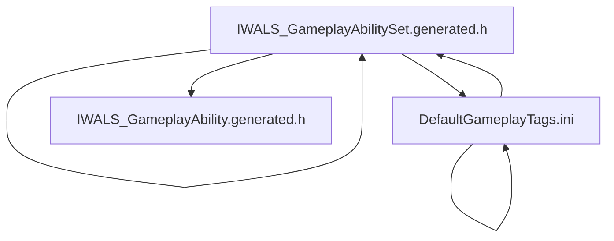

The provided CONTEXT does not include explicit details about the grappling hook class structure or its integration from the HUD selection wheel to gameplay within the plugins.

However, based on the typical Unreal Engine plugin and gameplay ability system structure visible in the snippets, here is a general outline of how such a system might be structured, and where to look for the grappling hook implementation:

---

### Likely Grappling Hook Class Structure and Flow

1. **HUD Selection Wheel Integration**
   - The grappling hook ability would be exposed as an option in the HUD selection wheel UI.
   - This UI element likely triggers an input event or command that activates the grappling hook ability.
   - Look for UI widget classes or blueprints related to the selection wheel in the plugin or project UI folders.

2. **Gameplay Ability System (IWALS_AbilitySystem Plugin)**
   - Grappling hook functionality is probably implemented as a **Gameplay Ability** subclass.
   - Relevant classes:
     - `UIWALS_GameplayAbility` (base gameplay ability class) [^6]
     - `UIWALS_GameplayAbilitySet` (data asset holding sets of abilities) [^1][^2][^5]
   - The grappling hook ability would be defined as a subclass of `UIWALS_GameplayAbility`.
   - It would be bound to an input or gameplay tag, possibly configured in `UIWALS_GameplayAbilitySet`.

3. **Gameplay Tags**
   - Gameplay tags are used to categorize and trigger abilities.
   - Check `DefaultGameplayTags.ini` for tags related to locomotion or interaction that might correspond to grappling hook usage.
   - Tags like `Locomotion.Custom.RopeSwing` or similar could be relevant [^4].

4. **Ability Activation and Execution**
   - When the player selects the grappling hook from the HUD, the ability system activates the grappling hook ability.
   - The ability handles the logic for firing the hook, attaching to surfaces, and pulling the player.
   - This might involve ability tasks or custom components within the IWALS_AbilitySystem plugin [^7].

---

### Where to Look in the Codebase

- **HUD/UI**
  - UI widgets or blueprints for the selection wheel.
  - Input bindings that connect UI selection to ability activation.

- **IWALS_AbilitySystem Plugin**
  - `UIWALS_GameplayAbility` subclasses for grappling hook ability.
  - `UIWALS_GameplayAbilitySet` data assets that include the grappling hook.
  - Gameplay tags in `DefaultGameplayTags.ini` related to grappling or rope swing.

- **Gameplay Ability Implementation**
  - Ability task files or custom logic in the plugin source (e.g., `AbilityTask_DelayWithTick.cpp` hints at custom ability tasks) [^7].

---

### Summary

- The grappling hook is likely implemented as a **Gameplay Ability** within the IWALS_AbilitySystem plugin.
- It is exposed via the HUD selection wheel UI that triggers ability activation.
- Gameplay tags categorize and manage the ability's activation conditions.
- The ability logic is handled in the plugin's gameplay ability classes and tasks.

---

If you need exact class names or code, please check:

- The UI widget blueprints or C++ classes for the selection wheel.
- The `UIWALS_GameplayAbility` subclasses in the plugin source.
- The `UIWALS_GameplayAbilitySet` data assets for ability bindings.
- Gameplay tags in `DefaultGameplayTags.ini` for relevant tags.

[^1]: IWALS_GameplayAbilitySet.generated.h (plugin)
[^2]: IWALS_GameplayAbilitySet.generated.h (plugin)
[^4]: DefaultGameplayTags.ini (locomotion tags)
[^5]: IWALS_GameplayAbilitySet.generated.h (plugin)
[^6]: IWALS_GameplayAbility.generated.h (plugin)
[^7]: IWALS_AbilitySystem Module source files

---
**References**

[^1] /ingest/plugins/IWALS_AbilitySystem/Intermediate/Build/Win64/UnrealEditor/Inc/IWALS_AbilitySystem/UHT/IWALS_GameplayAbilitySet.generated.h
[^2] /ingest/plugins/IWALS_AbilitySystem/Intermediate/Build/Win64/UnrealEditor/Inc/IWALS_AbilitySystem/UHT/IWALS_GameplayAbilitySet.generated.h
[^3] /ingest/project/Config/DefaultGameplayTags.ini
[^4] /ingest/project/Config/DefaultGameplayTags.ini
[^5] /ingest/plugins/IWALS_AbilitySystem/Intermediate/Build/Win64/UnrealGame/Inc/IWALS_AbilitySystem/UHT/IWALS_GameplayAbilitySet.generated.h
[^6] /ingest/plugins/IWALS_AbilitySystem/Intermediate/Build/Win64/UnrealEditor/Inc/IWALS_AbilitySystem/UHT/IWALS_GameplayAbility.generated.h
[^7] /ingest/plugins/IWALS_AbilitySystem/Intermediate/Build/Win64/x64/UnrealEditor/Development/IWALS_AbilitySystem/Module.IWALS_AbilitySystem.cpp
[^8] /ingest/project/Config/DefaultGameplayTags.ini

### Diagram
